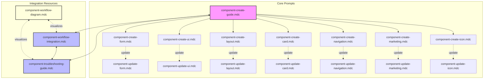
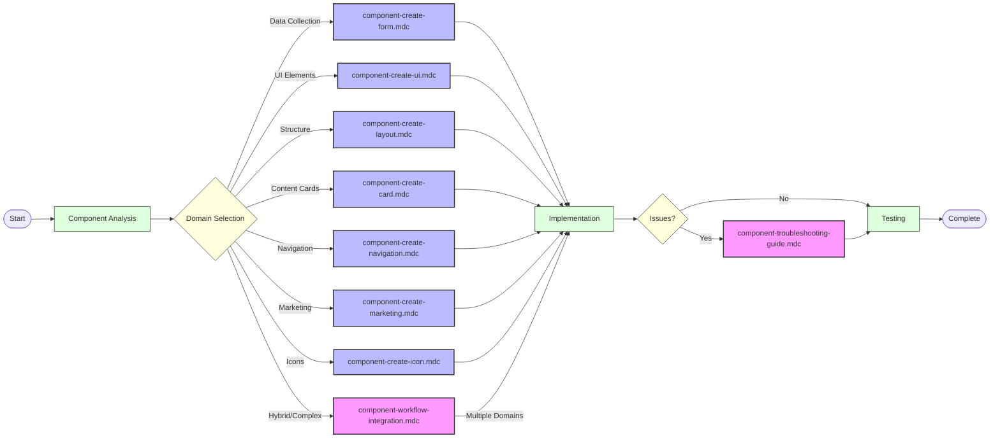
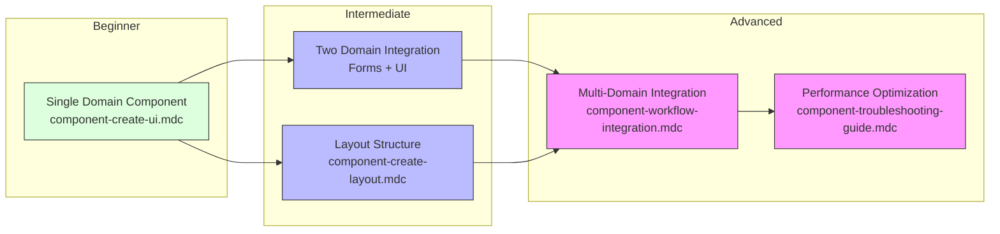
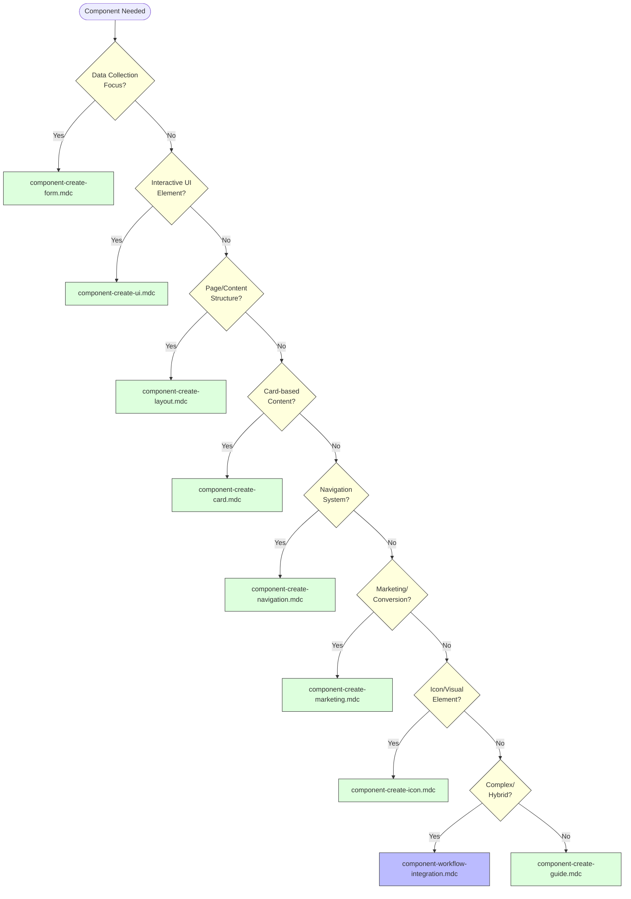

---
description:
globs:
alwaysApply: false
---
# 📊 Component Development Workflow Diagrams

> **Visual reference diagrams for component prompt system workflows and integration patterns.**

## 🎯 **PROMPT SYSTEM ARCHITECTURE**



## 🔄 **COMPONENT DEVELOPMENT WORKFLOW**



## 🛠️ **MULTI-PROMPT INTEGRATION PATTERN**

```mermaid
flowchart TD
    subgraph "Component Architecture"
        Layout["Layout Component<br>(component-create-layout.mdc)"]
        Nav["Navigation Component<br>(component-create-navigation.mdc)"]
        Card["Card Component<br>(component-create-card.mdc)"]
        Form["Form Component<br>(component-create-form.mdc)"]
        UI["UI Elements<br>(component-create-ui.mdc)"]
        
        Layout --> Nav
        Layout --> Card
        Layout --> Form
        Card --> UI
        Form --> UI
    end
    
    Start(["Start"]) --> Layout
    Layout --> Quality["Quality Gates"]
    Quality --> Issues{"Issues?"}
    Issues -->|"Yes"| Troubleshoot["Troubleshooting<br>(component-troubleshooting-guide.mdc)"]
    Issues -->|"No"| Done(["Complete"])
    Troubleshoot --> Issues
    
    classDef container fill:#f5f5f5,stroke:#333
    classDef component fill:#dfd,stroke:#333
    classDef process fill:#bbf,stroke:#333
    classDef decision fill:#ffd,stroke:#333
    
    class "Component Architecture" container
    class Layout,Nav,Card,Form,UI component
    class Quality,Troubleshoot process
    class Issues decision
```

## 📈 **COMPONENT COMPLEXITY PROGRESSION**



## 🧩 **PROMPT SELECTION DECISION FLOW**



---

**These visual diagrams provide clear guidance on component development workflows, prompt selection, and integration patterns. Use them in conjunction with detailed documentation for optimal component development.**
